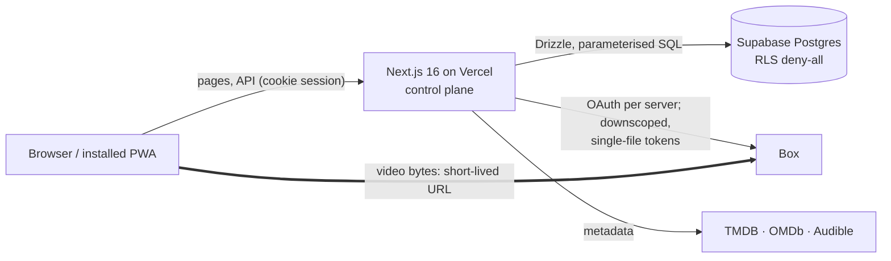

<p align="center">
  
</p>

<p align="center">
  <strong>A private, multi-tenant media server in the cloud.</strong><br>
  Movies, TV, audiobooks, music-style audio, and a Google&nbsp;Photos-style library, streamed straight from your own Box storage.
</p>

<p align="center">
  
  
  
  
  
  
</p>

---

## What it is

Roam is a Plex-style media server with two deliberate departures:

1. **The storage is Box, not a NAS.** Each server connects its *own* Box account over OAuth, and the browser streams video **directly from Box** using short-lived, single-file download URLs. There are no media servers to run.
2. **The app is a stateless control plane on Vercel's free tier.** It handles auth, metadata, access control, and URL minting, and it is built so that it never has to move video bytes or transcode.

It is a real, working product, not a tutorial project: it has accounts, per-person profiles with age limits, shareable libraries, resumable playback, playlists, and photo browsing with a few-thousand-photo timeline. This README is written for people evaluating the engineering, so it leads with the interesting problems.

> **Status:** in daily use by a small group of people. The code is open for review, and a [public demo server](#public-demo) lets you try it without an account or any setup.

## Engineering highlights

### Seamless multi-file playback
Movies ripped as `Part 1` / `Part 2` (and combined multi-episode files) play as **one continuous video**. A custom dual-`<video>` player preloads the next segment on a second element and swaps at the boundary, tracks a single virtual timeline across files, handles trims for combined episodes, and refreshes expiring Box URLs mid-playback. Position is saved per profile.

### Metadata and codecs without ffmpeg on the hot path
Duration, codecs, chapters, and cover art are read with **hand-written, bounded parsers** that fetch only a few KB with HTTP range requests (MP4/MOV atoms, MP3 ID3v2.2–2.4 + ID3v1, EXIF/TIFF, HEIC/HEIF boxes, JPEG/PNG/GIF/WebP headers). A scan never downloads a whole file.
Because these parse **untrusted files**, every read is range-checked, loops and allocations are capped, impossible dates and dimensions are rejected, and the parsers are covered by seeded fuzz tests that must never throw or hang.

### Scanning that is safe to run against someone's library
- **Time-budgeted and resumable.** Vercel Hobby caps functions at 60 s, so scans work in single-transaction slices with a resumable depth-first cursor, and pick up automatically on the next page load.
- **Cleanup that can't wipe a library.** Files removed from Box are pruned only after a *clean* scan cycle, each candidate is verified against Box by id, a grace period applies, and a hard cap refuses to delete when the number looks like an outage or a wrong folder.
- One scan engine drives video, audio, and photo libraries through a small "profile" object (what a file becomes, what is probed, what is read).

### Multi-tenancy and access control
- Anyone can sign up; they then create or join a **server**. One admin per server; invites are viewer-only.
- **Per-library sharing**: a library is visible to everyone on the server or to chosen accounts only. A single choke point (`libraryVisible`) is used by every reader, and a test walks the source tree to enforce it.
- **Profiles with age limits** (Netflix-style): content is filtered in SQL, before ordering and paging, so a hidden item can't leak through a count, a cursor, or a "next" button.
- Every refusal (missing, hidden, age-blocked, wrong kind) is the **same 404**, so nothing confirms an item exists.
- Box tokens are **AES-256-GCM encrypted at rest**; Postgres row-level security is deny-all (the app is the only client); sign-up and heavy routes are rate-limited in Postgres.

### A photo library that scrolls like Google Photos
- **The whole timeline is laid out up front.** Month counts give every block its exact pixel height, and blocks fill as they near the screen. Scrubbing to any month is just a scroll: nothing is inserted above you, no scroll-correction hacks.
- A viewer that opens as an **overlay** (instant close, scroll position untouched), with pinch/double-tap zoom, swipe between items, swipe-down to close, and neighbours that slide in with the finger.
- EXIF dates and HEIC support, a month scrubber that scrolls live, favorites per profile, search by name or date, and day/month/year zoom levels.
- Thumbnails and previews are proxied through one access-checked gate with private caching; no image is stored in the database.

### Honest handling of what browsers can't play
Roam deliberately does no server-side transcoding. For files whose audio browsers can't decode (AC-3, E-AC-3, DTS) it detects the codec during the scan and offers a **remux** (video copied, audio to AAC) as a separate "browser-friendly" file linked to the original. For phone videos (HEVC) in photo libraries it uses **Box's own H.264 rendition**, handed to the browser behind a token scoped to a single file.

## Architecture



Video bytes never pass through Vercel. Photo thumbnails and previews do (small, cached, and gated by the same access check as everything else).

## Public demo

You can try Roam as a guest, with no email or password: open the demo link, press **Continue as a guest**, and you're browsing a demo server.

**Demo link:** <https://roam-three-gray.vercel.app/join/9XZLaau-Tl9bxfQLQ7Ggy2qdRESKx_UQ>

What to know before you click:

- **Some of it is placeholder.** The demo's movies and shows have real, familiar names, and their posters, descriptions and ratings come from TMDB, but every video is a 45-second clip cut from one of two openly licensed films (Big Buck Bunny and Sintel, Creative Commons Attribution 3.0). In the same way, the albums by famous artists carry real titles, track lists and covers (from MusicBrainz) but 40-second clips of CC0 Chopin recordings, and the J.R.R. Tolkien books (still in copyright) are placeholder EPUBs with public-domain text. None of it is the work named. A banner says so on every page, and the credits page lists each source, its author and its licence. The photos, Chopin recordings, LibriVox audiobooks and Project Gutenberg books are real, openly licensed material, shown as what they are.
- **You're a viewer, and invisible.** A guest can watch and make their own playlists and favorites; they can't change anything, can't create servers, and other visitors can't see them. Guest accounts are deleted after about a week without a visit.
- **It has a daily play limit.** The videos stream from a real Box account, so the demo allows a fixed number of plays per day across all visitors. If it's "resting", come back tomorrow.

How it's built (the interesting part, for reviewers): a server's admin can switch on an **open join link** that only ever adds a *viewer* (a database rule makes a second admin impossible, and joining never changes an existing member's role). Guests are real accounts created with Supabase's anonymous sign-in, flagged as guests, hidden from other members from the first moment, refused anything that spends the owner's API quota, and cleaned up by a routine that deletes in dependency order and re-checks inactivity inside the transaction. Per-account limits are meaningless when accounts are free, so the real cost cap is a daily total for the whole demo, recorded against the server's owner.

## Tech stack

| Area | Choice |
|---|---|
| Framework | Next.js 16 (App Router, Server Components, route handlers, `proxy.ts`), React 19, TypeScript |
| Data | PostgreSQL on Supabase, **Drizzle ORM**, 30 migrations (enum changes split from their first use, additive-first) |
| Auth | Supabase Auth (magic link, Google, email + password), custom roles, profiles |
| Storage | Box (OAuth 2, downscoped tokens, byte-range reads, representations API) |
| UI | Tailwind CSS 4, shadcn/Base UI, Lucide, installable PWA |
| Metadata | TMDB, OMDb, Audible (all optional or fully offline for "generic" libraries) |
| Tests | **Vitest** with in-memory Postgres (**PGlite**) replaying the real migrations; ~1,100 tests |
| Hosting | Vercel (Fluid compute) with a Postgres-backed rate limiter and no extra services |

## Quality and testing

- Tests run against a **real Postgres engine in memory** with the production migrations, so constraints, locks, indexes, and cursor ordering are exercised, not mocked.
- Security-relevant guards (library access, age filtering, uniform 404s, kind allow-lists, rate limits) each have a test that was checked to **fail when the guard is removed** (manual mutation testing).
- Source-level enforcement tests fail the build if a new reader skips the access helper or a new code path special-cases a library kind with a string literal.
- Every feature went through plan → independent review → small commits → independent review again; the commit history reflects that.

### Trailers and extras

A movie's page lists its trailers and other extras when its folder has them, named the way Plex names them. Either put the type at the end of the file name, right after a hyphen (`Teaser-trailer.mp4`, `Making Of-behindthescenes.mp4`, `Cut Scene-deleted.mp4`, `The Look-featurette.mp4`, `Talk-interview.mp4`, `Opening-scene.mp4`, `Little Film-short.mp4`, `Misc-other.mp4`), or put the videos in a subfolder of the movie's folder named for the type (`Trailers`, `Behind The Scenes`, `Deleted Scenes`, `Featurettes`, `Interviews`, `Scenes`, `Shorts`, `Other`). They are found on the next scan of the library (or Resync on the movie), appear once Roam has read their length, and play in the normal player. They never record progress and aren't offered for download. Only MP4, M4V and MOV files are used, as for movies.

### Help me choose

**Help me choose** is a button on Home and on every library page except Photos (Movies, TV Shows, Videos, Audiobooks, Audio, Music and eBooks). From Home you first tick the libraries to choose from; from a library page that library is used. It shows two random things at a time (a library is picked at random first, so a small one isn't drowned out by a big one; only things you are allowed to see and that are ready to play are offered). Choose one, then either **Watch / Listen to / Read it** (a show starts on the first episode you haven't finished, a music item is an album) or **Keep choosing**, which sets your pick against a new one, and so on. Nothing is shown twice until the libraries run out. After every fifteen rounds it asks whether to choose for you: play something random from the libraries, keep going, or play one of the two on screen.

### Music and audio views

A **Music** library is browsed as **Artists | Albums | Songs | Genres**; a generic **Audio** library as **Tracks | Artists | Albums | Genres | Folders**. Songs (Tracks) lists every song, with Play and Shuffle for the whole list, a search box (name, artist, album, folder) and a Sort menu (name, duration, artist). Genres, and in an Audio library Artists and Albums, list the groups as tiles; opening one lists its songs the same way, with Play and Shuffle for just that group. Each music artist's page has Play and Shuffle too. Artist, album and genre come from the files' own tags (the first artist, the album, and the genre(s)); songs scanned before genres were read are read once more, automatically, on the next scan. Songs with no artist, album or genre are grouped as "Unknown".

### Selecting several items

**Select** is on the Movies, TV Shows and Audiobooks library pages, on the Artists and Albums tabs of a music library, on every song list (Songs, Tracks, and the songs of an artist, album or genre), and on the folder views of Video and Audio libraries (not Photos, and not eBooks, which can't be played or downloaded). It puts a checkbox on every card: click to choose (Shift-click for a range), or **Select all** to take everything the page covers, not only what is on screen: every title matching the current search and filters, every page of the folder you are in, or every album or artist of the library. The bar then offers **Add to playlist** (everything chosen goes into one playlist you can edit, or a new one, in the order shown; albums and artists go in as their songs) and **Download** (a dialog adds up the sizes, lets you pick one resolution for all, using the closest available for each, and saves them one after another; a show stands for all its episodes). Big selections are handled in rounds. A generic Audio library has a search box (name, artist, album or folder, across the whole library) and a Sort menu (name, duration or artist; choosing the one in use turns it around), like the Movies page's, and Select all follows the search and the order. In a folder view, folders themselves can't be selected, only the files directly in the folder you are in.

### Downloads (offline)

Any movie, episode, song, album or audiobook can be saved on the device you are using: **Download** is in the More menu on a movie or audiobook page and on episode rows, a button on song rows, and **Download album** in an album's More menu. For a movie or episode the dialog lists each resolution version with its size; you pick one. The file goes into the browser's private storage (it streams straight from Box to disk, so a multi-gigabyte film never sits in memory; an interrupted download carries on from the byte it reached, and a connection that goes silent is dropped and resumed). Downloaded items are played from the device in the usual players, with or without a connection, and show up under **Downloads** in the sidebar. Where you were is remembered on the device and sent to the server once there is a connection again.

With no connection the installed app opens a page of your downloads (`/offline`, kept by a service worker that is refreshed with each deployment) and plays them from there. Downloads belong to that browser on that device: clearing the site's data removes them, and the browser may clear them when it is short of space (the app asks it not to). It needs a browser with private file storage: current Chrome, Edge, Firefox and Safari (on an iPhone, installed to the Home Screen). The player's other settings, such as subtitles you load from a file, work offline too; searching OpenSubtitles does not.

### Subtitles

Anyone who can watch a movie, video or episode can load subtitles for that viewing: in the player's captions menu (web) or with Down (TV), find one on OpenSubtitles, or on the web load an SRT, WebVTT or ASS file from the device (2 MB at most). Nothing is stored: subtitles are gone when the player closes, and each time the player loads you choose them again. Searching OpenSubtitles needs `OPENSUBTITLES_API_KEY`, `OPENSUBTITLES_USERNAME` and `OPENSUBTITLES_PASSWORD` (see `.env.example`); every download comes out of that one account's daily allowance.

### Turning on the CAPTCHA

Sign-in has Cloudflare Turnstile support that stays off until you configure it, so nothing changes for anyone until then. Order matters, because once Supabase requires a token a build without the widget cannot sign anyone in:

1. Create a Turnstile widget in the Cloudflare dashboard for your domain.
2. Set `NEXT_PUBLIC_TURNSTILE_SITE_KEY` (the public site key) in Vercel and redeploy.
3. In Supabase, Authentication > Attack Protection, turn on CAPTCHA, choose Turnstile and paste the **secret** key.
4. Run `npx tsx --env-file=.env.local scripts/check-captcha.ts` to confirm Supabase now refuses a sign-in without a token.

## Libraries and features

| Library type | What you get |
|---|---|
| **Movies / TV Shows** | TMDB posters and metadata, Plex-style naming (`{tmdb-123}`, `- pt1`, editions, extras), seasons and episodes, ratings from IMDb and Rotten Tomatoes |
| **Audiobooks** | Audible matching, chapters, resume, a persistent mini-player |
| **Music** | Artist > Album > Song from the folder layout; albums matched on MusicBrainz for names, years, track titles and cover art (clear matches only, switchable per library); album pages with play, shuffle and a queue |
| **Generic video / audio** | Folder-mirrored browsing; names, artist, and cover read from the files' own tags; one library-wide age rating |
| **Photos & videos** | Timeline + albums, favorites, search, scrubber, zoom levels, viewer |

Also: a **TV interface** (`/tv`: server-rendered pages plus one script built for Chromium 56, so it runs on a 2018 Samsung, with extras on newer TVs; movies, shows, videos, music, audio, photos, audiobooks, search, playlists; sign-in by a five-character code approved from a phone; guide for relatives at `/help/tv`; Samsung/LG packages in [`tv/`](tv/README.md)), playlists with sharing roles, per-profile watch history, global search, per-library sharing and age ratings, a resumable admin scan with live progress.

## Getting started

Prerequisites: Node.js 20.9+, a [Supabase](https://supabase.com) project, a [Box](https://developer.box.com) custom app (OAuth 2.0), and optionally a [TMDB](https://www.themoviedb.org/settings/api) token and an [OMDb](https://www.omdbapi.com/apikey.aspx) key.

```bash
npm install
cp .env.example .env.local     # fill in the values; each one is commented
npm run db:migrate             # apply the Drizzle migrations
psql "$POSTGRES_URL" -f supabase/rls.sql   # deny-all row-level security (read its header first)
npm run dev                    # http://localhost:3000
npm test                       # ~1,100 tests, no external services needed
```

1. In the Box developer console, create an **OAuth 2.0** custom app and register `/api/box/callback` (local and production) as a redirect URI.
2. Generate `TOKEN_ENCRYPTION_KEY` with `openssl rand -base64 32` (it encrypts each server's Box tokens; rotating it requires reconnecting every server).
3. Sign up, **create a server**, connect Box, then add a library by choosing a Box folder and a type. Scans can be started from the admin page.

Deploying: import the repo into Vercel with the same environment variables (use the pooled `POSTGRES_URL`, port 6543). Note `vercel.json` must enable deployments for your production branch.

Folder naming for Movies/TV follows Plex conventions, e.g. `Movies/The Matrix (1999)/The Matrix (1999).mp4`, `Movie (2001)/part1.mp4`, `Show (2015)/Season 01/S01E01 - Pilot.mp4`. Pre-convert to H.264/AAC `.mp4`, `.m4v`, or `.mov`.

**Resolution versions.** Save the same movie or episode in more than one resolution with Plex's version naming, a ` - <resolution>` segment in the file name: `The Matrix (1999) - 1080p.mp4` and `The Matrix (1999) - 4K.mp4`, or `Show - S01E01 - 720p.mp4` and `Show - S01E01 - 1080p.mp4` (a split version keeps its parts: `Movie (2020) - 4K - pt1.mp4`). The label must start with a resolution word (`480p`, `720p`, `1080p`, `2160p`, `4K`, `UHD`, `HD`, `SD`, optionally followed by more words such as `1080p BluRay`), so an episode's title is never mistaken for one. By default the highest resolution plays; the player's settings menu (the gear on the web, Up on the TV) has a Quality choice, and the pick is remembered per device (the closest available resolution is used for other titles). A file with no label is just another version, shown by its real resolution.

To make the lower resolutions from files you already have, run `scripts/make-versions-box.ts` (same way as `remux-box.ts`: `npx tsx --env-file=.env.local scripts/make-versions-box.ts --dry-run`, then without `--dry-run`). For each movie and episode it reads the real resolution and encodes every rung of 2160p / 1440p / 1080p / 720p / 480p / 360p / 240p / 144p that is *below* the original (H.264, bitrate-capped to stay under Box's file size limit), uploading each next to the original as `<name> - 720p.mp4`. Each rung keeps the original's audio; when that audio is AC-3/DTS or similar it also gets an AAC copy beside it (`<name> - 720p.aac.mp4`), like the original's own. A film that is in several parts becomes one file per new version (the original's parts are left alone). Finally the original is renamed to say what it is (`<name> - 1080p.mp4`, each part, and its `.aac` copy). Safe to re-run; options include `--only movies|shows`, `--library`, `--title`, `--rungs 720,480`, `--limit`, `--skip-rename`, `--preset`, `--crf`. Each new version is added to Roam as soon as it is uploaded, so no rescan is needed.

## Project structure

```
src/
  app/            routes: (app)/s/[serverId]/…  library, title, show, book, photo, watch, admin
                  api/                           control-plane routes (play, scan, photos, playlists, …)
  components/     player/ (dual-video player), photos/ (timeline, viewer, scrubber), admin/, library/, ui/
  lib/
    scan/         scanner, file-tree engine, tag/EXIF/HEIF/MP4/ID3 parsers, prune
    storage/      StorageProvider interface + Box implementation
    content/      access rules: library visibility, age filtering
    photos/       timeline queries, search, layout maths, favorites, gestures
    player/       play manifest + timeline maths
    remux/        audio remux pipeline (local runner, sandbox tier)
    db/           Drizzle schema + client
drizzle/          SQL migrations         supabase/rls.sql   deny-all RLS
```

## Known limitations

- Box is the only storage provider (the code sits behind a `StorageProvider` interface, so another is possible).
- No general transcoding, by design: unsupported audio is remuxed on request, and everything else must already be browser-friendly.
- TMDB's terms ask that its data be refreshed at least every six months; Roam does not yet refresh stored metadata on a schedule.
- Touch gestures in the photo viewer are covered by unit tests of their logic, but have been hand-tested on a small number of devices.
- Music (artist/album) and eBook (EPUB/PDF/Markdown) libraries are planned, not built.

## Credits and attribution

- Movie and TV metadata and images: [TMDB](https://www.themoviedb.org). *This product uses the TMDB API but is not endorsed or certified by TMDB.*
- Demo footage: clips cut and re-encoded from Big Buck Bunny (© copyright 2008, Blender Foundation / www.bigbuckbunny.org) and Sintel (© copyright Blender Foundation | durian.blender.org), both CC BY 3.0. See `src/lib/demo/catalog.ts` and the demo's credits page.

## About

Built by [Matt Rinker](https://github.com/mjrinker). Developed with AI pair-programming (Claude Code) under a plan-then-review workflow, with every change reviewed and tested before it shipped.
